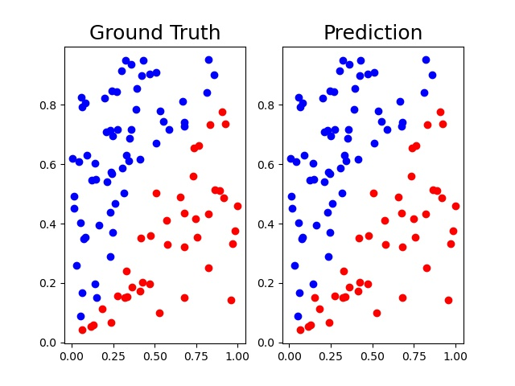
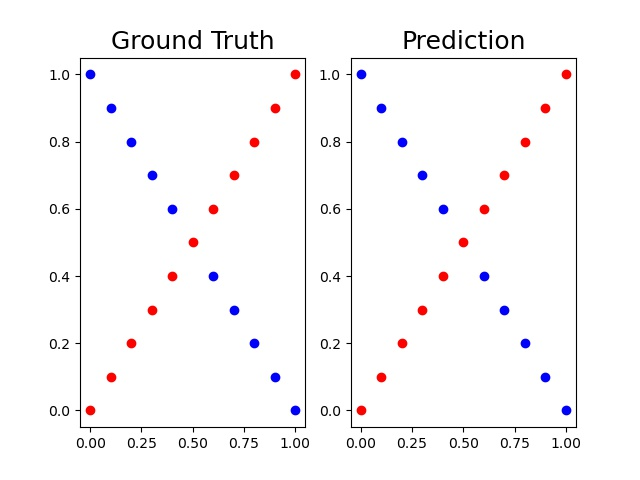

# Back-propagation

[Zhi-Yi Chin](https://joycenerd.github.io), National Yang Ming Chiao Tung University




In this lab, we will need to understand and implement simple neural networks with forwarding pass and backward propagation using only two hidden layers. The simple neural network we are going to implement is a feedforward neural network.

## Setup (with [Anaconda](https://www.anaconda.com/))

Install dependencies: `conda env create -f environment.yml`

Activate environment: `conda activate backprop`

## Datasets

1. Linear data: `./data/linear_data.csv`
2. XOR data: `./data/xor_data.csv`

## Pretrained Models

1. Linear case: `./checkpoints/linear_0.01_(512,32).pkl`
2. XOR case: `./checkpoints/xor_0.1_(512,32).pkl`

## Training and Testing

```
python main.py [-h] [--task TASK] [--lr LR] [--hidden-size HIDDEN_SIZE] [--load LOAD]

optional arguments:
  -h, --help            show this help message and exit
  --task TASK           which kind of data to process: [linear, xor]
  --lr LR               learning rate
  --hidden-size HIDDEN_SIZE
                        two hidden layer neuron numbers (layer1,layer2)
  --load LOAD           if testing weight is loading from file
```

ex:
```
python main.py --task xor --lr 0.1 --hidden-size (512,32) --load False
```

