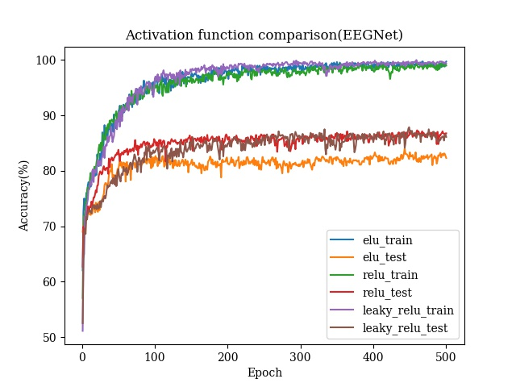

# EEG Classification

In this lab we are implementing two EEG classification model which are EEGNet and DeepConvNet. Also, we are changing the activation function (ELU, ReLU, LeakyReLU) in the model and see the difference. The dataset of for this lab is from the BCI competition and the shape is (C=1, H=2, W=750).



In the normal convolution, the network learns frequency filters. Then in the depthwise convolution, the network connects to each feature map individually to learn frequency-specific spatial filters. The separable convolution combines a depth-wise convolution and learns a temporal summary for each feature map individually, followed by a pointwise convolution, which learns how to mix the feature maps optimally. We flatten the feature maps in the classifier, use one linear layer, and outputs two-class probability. 

As for the network structure, the only difference between our network and the [original paper](https://arxiv.org/pdf/1611.08024.pdf) is choosing the activation function we want to use. In the original paper, the activation function is ELU.

## Usage

Clone the repository locally and direct
```
git clone https://github.com/joycenerd/Deep_Learning_Practice_labs.git
cd lab2
```

Make a new conda env and activate it:
```
conda env create -f environment.yml
conda activate EEG
```

## Pre-training

### EEGNet

|           | lr    | init_w | amsgrad | train_acc | test_acc | model |
|-----------|-------|--------|---------|-----------|----------|-------|
| ELU       | 0.005 | x      | v       | 99.26%    | 84.07%   | [model](./checkpoints/EEGNet/EEGNet_elu_5e-3_amsgrad_0.8407.pt)      |
| ReLU      | 0.001 | x      | x       | 99.44%    | 87.31%   | [model](./checkpoints/EEGNet/EEGNet_relu_1e-3_0.8731.pt)      |
| LeakyRelU | 0.01  | v      | v       | 99.44%    | **87.87%**   |  [model](./checkpoints/EEGNet/EEGNet_leaky_relu_1e-2_init_amsgrad_0.8787.pt)     |

### DeepConvNet

|           | lr    | init_w | amsgrad | train_acc | test_acc | model |
|-----------|-------|--------|---------|-----------|----------|-------|
| ELU       | 0.001 | x      | v       | 76.48%    | 74.54%   |  [model](./checkpoints/DeepConvNet/DeepConvNet_elu_1e-3_amsgrad_0.7454.pt)     |
| ReLU      | 0.01  | x      | x       | 74.07%    | 71.02%   |  [model](./checkpoints/DeepConvNet/DeepConvNet_relu_1e-2_0.7102.pt)     |
| LeakyRelU | 0.01  | v      | v       | 72.69%    | 73.52%   |   [model](./checkpoints/DeepConvNet/DeepConvNet_leaky_relu_1e-2_init_amsgrad_0.7352.pt)    |

