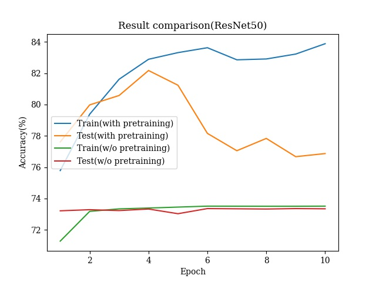

# Diabetic Retinopathy Detection

In this lab, we analyzes diabetic retinopathy using ResNet, specifically using ResNet18 and ResNet50. We will also compare the results of ResNet18, ResNet50, and both networks with pre-trained weights. We also calculate the confusion matrix between the true label and the predicted label.

## Data

You can download the images [here](https://drive.google.com/open?id=1RTmrk7Qu9IBjQYLczaYKOvXaHWBS0o72). You can find the training and testing corresponding image name and label in `./Data`.

## Training

### Install dependencies

```
conda env create -f environment.yml
conda activate resnet
```

### Sample running code

```
python train.py \
    --model resnet50 \
    --pretrain True \
    --act relu \
    --device cuda:0 \
    --batch-size 32 \
    --lr 1e-3 \
    --epochs 10 \
    --load False \
    --img-size 256
```

## Results

### Accuracy curve



### Confusion matrix

