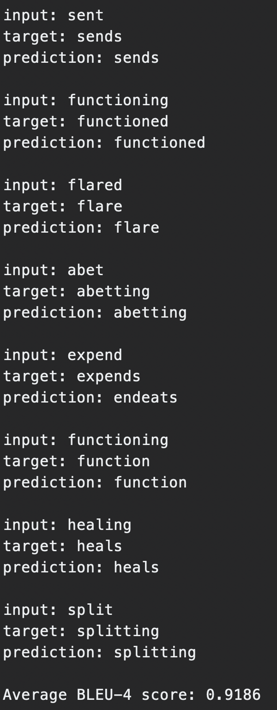
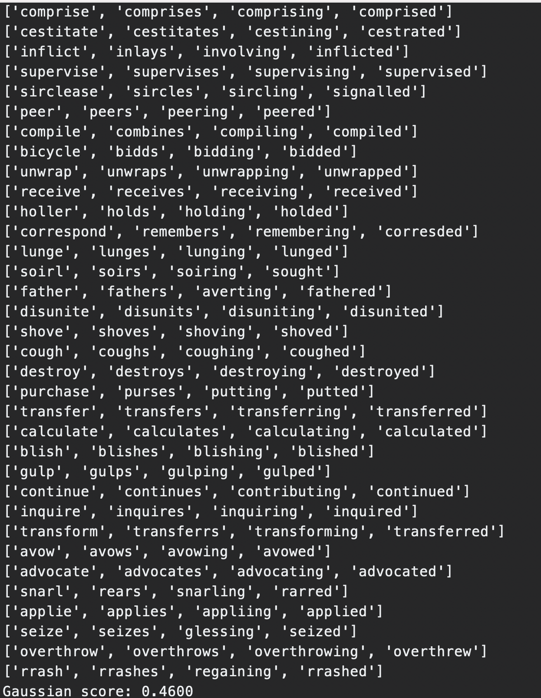
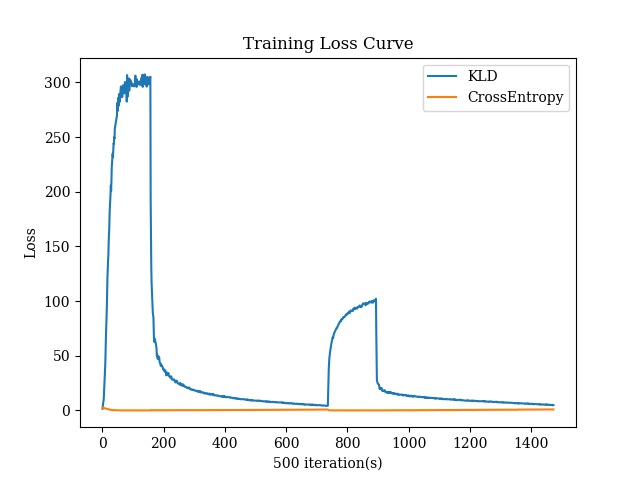
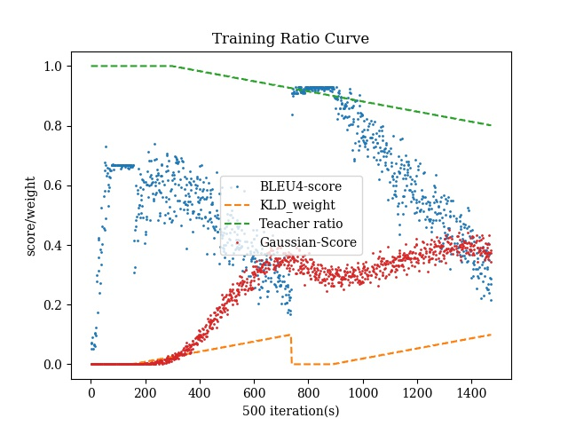

# Conditional sequence-to-sequence VAE

In this lab, we are implementing conditional seq2seq VAE for English tense conversion and generation.

## Data
Data is provided in `./data`. `./data/train.txt` contains 1227 words each with 4 tenses. `./data/test.txt` contains 10 pairs of tense conversion, detail is in `./data/readme.txt`.

## Training

### Install dependencies

```
conda env create -f environment.yml
conda activate cvae
```

### Sample running code

```
python train.py \
    --batch-size 1 \
    --input-size 28 \
    --hidden-size 256 \
    --c-size 4 \
    --c-hidden-size 8 \
    --z-size 32 \
    --device "cuda:0" \
    --lr 0.05 \
    --epochs 150 \
    --start-epoch 1 \
    --final-tf-ratio 0.8 \
    --final-kl-w 0.1 \
    --kl-anneal-cyc 2 \
    --anneal-method "cyclic" \
    --mode "train"
```

## Results

### Tense conversion


### Word generation


### Loss curve


### Ratio/score curve
