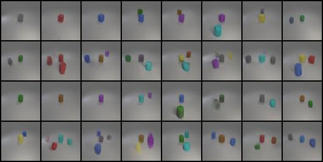

# Let's Play GANs

In this lab, we implement conditional GAN to generate synthetic images in multi-label conditions. Given a latent vector $z$, which is randomly generated, and a dependent vector, we trained a generator to generate objects with specific colors and shapes; conditional GAN should do this.

## Data
We are using [CLEVR](https://cs.stanford.edu/people/jcjohns/clevr/) as our dataset. For dealing with the labels in the JSON file, we use `get_iCLEVR_data()` function in `dataset.py`. For images, we apply transformations that resize the image to 64x64, transform the value into a tensor and normalize the pixel values.

## Training

### Install dependencies

```
conda env create -f environment.yml
conda activate gan
```

### Sample running code

```
python train.py \
    --batch-size 128 \
    --im-size 64 \
    --z-size 128 \
    --g-conv-dim 300 \
    --d-conv-dim 100 \
    --device "cuda:0" \
    --g-lr 0.0001 \
    --d-lr 0.0004 \
    --beta1 0.0 \
    --beta2 0.9 \
    --epochs 300 \
    --eval-iter 50 \
    --num-cond 24 \
    --adv-loss "wgan-gp" \
    --c-size 100 \
    --lambda-gp 10 \
    --net "sagan"
```

## Results




