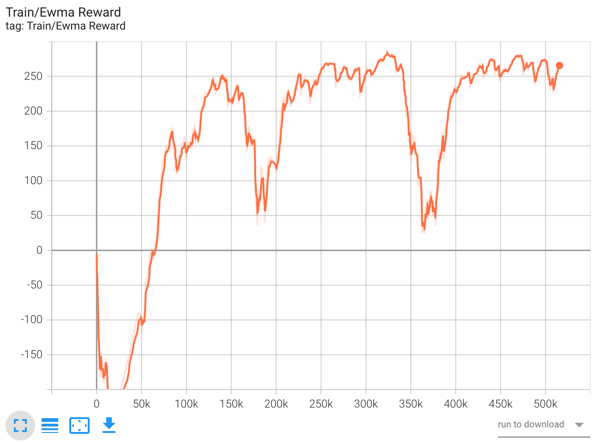
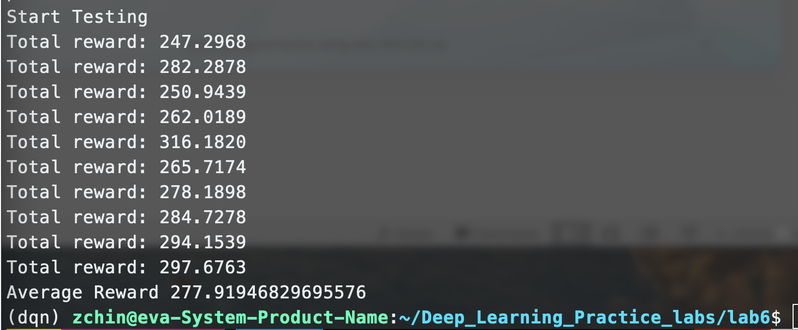
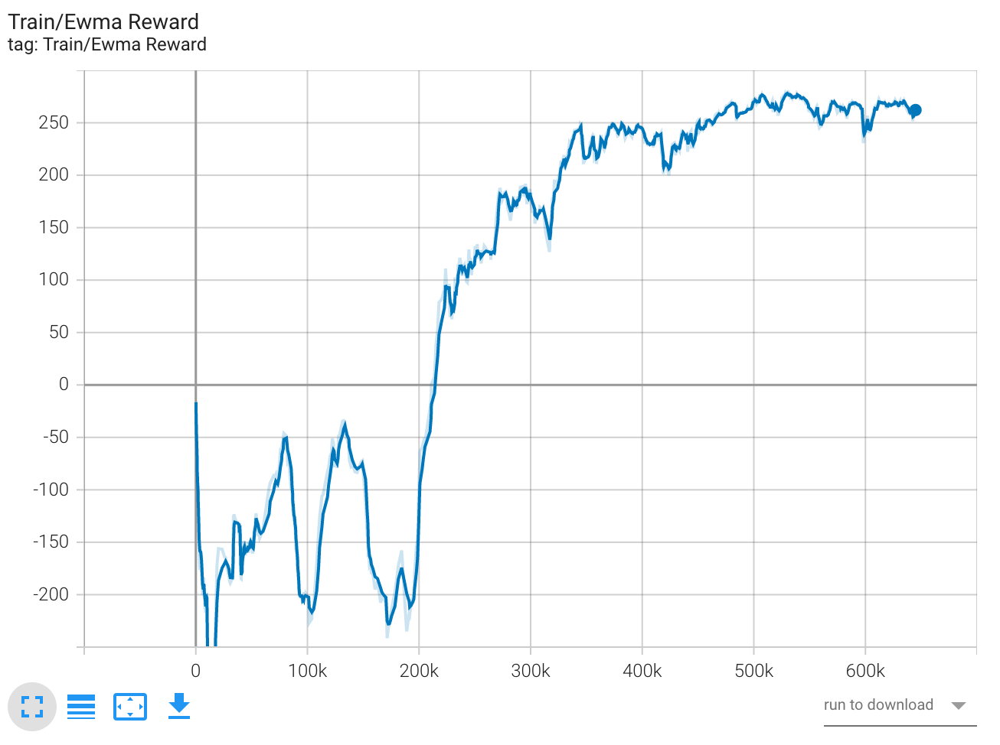
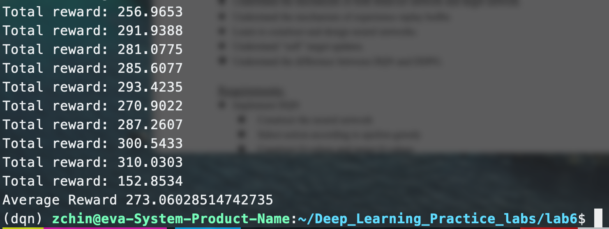
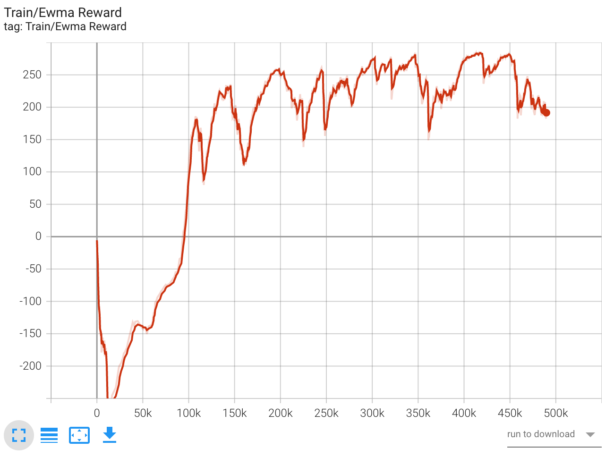
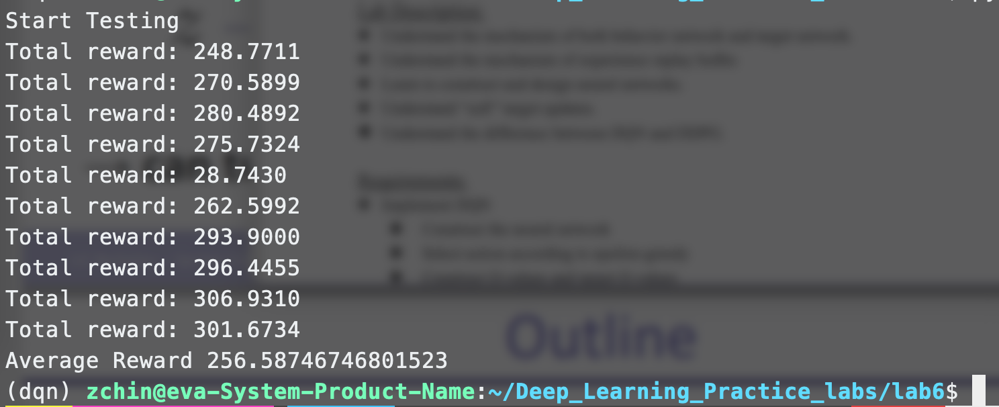

# Deep Q-Network and Deep Deterministic Policy Gradient

Implement DQN and DDQN to solve LunarLander-v2. Implement DDPG to solve LunarLanderContinuous-v2.

## Data

The data comes from [OpenAI Gym](https://gym.openai.com/). You can get the data by installing in your conda environment:
```
pip install gym
```
Importing in your Python code:
```python
import gym
env=gym.make('LunarLander-v2')
```

## Training

### Install dependencies

```
conda env create -f environment.yml
conda activate dqn
```

### Sample running code

```
python dqn.py \
    -m dqn.pth \
    --test_only True \
    --seed 20200519 \
    --test_epsilon 0.001
```

## Results

**DQN**
<table>
    <tr>
    <td>Training ewma reward</td>
    <td>Testing results</td>
    </tr>
    <tr>
        <td></td>
        <td></td>
    </tr>
</table>

**DDPG**
<table>
    <tr>
    <td>Training ewma reward</td>
    <td>Testing results</td>
    </tr>
    <tr>
        <td></td>
        <td></td>
    </tr>
</table>

**DDQN**
<table>
    <tr>
    <td>Training ewma reward</td>
    <td>Testing results</td>
    </tr>
    <tr>
        <td></td>
        <td></td>
    </tr>
</table>